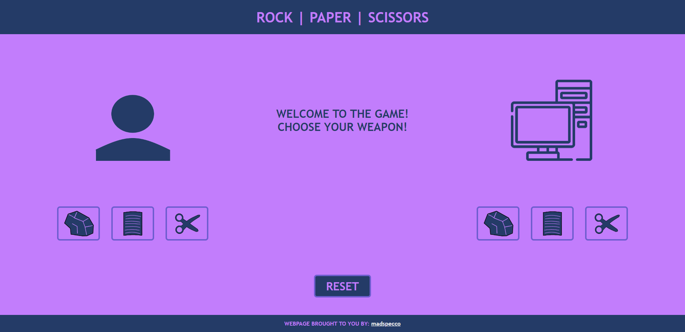

# Rock | Paper | Scissors

## Links
* [Try The Website here!](https://madspecco.github.io/rock-paper-scissors/)
* [Link to Assignment](https://www.theodinproject.com/lessons/foundations-rock-paper-scissors)

# About
This website was created within the Foundations Course of \
 the Odin Project in order to display basic JavaScript knowledge such as:

- Understanding Functions
- Loops
- Selecting/Creating Elements in HTML
- Event Listeners
- Adding/Remove an HTML Class
- Button Effects
- Enabling/Disabling Elements in HTML

# Overview
